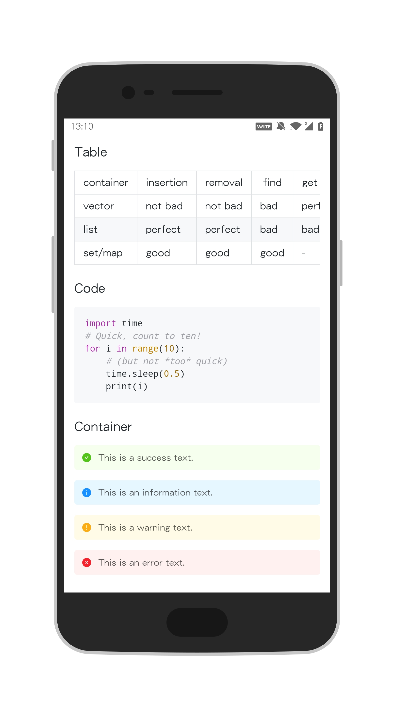
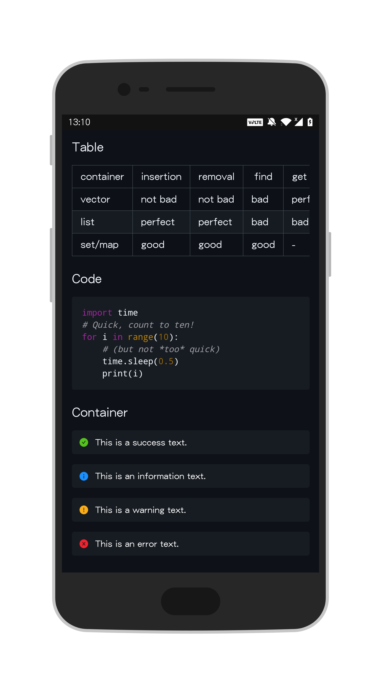
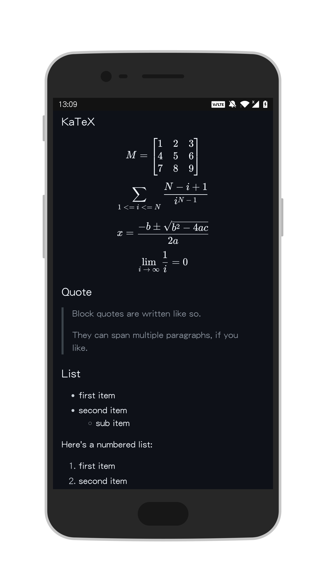

# markdown-it-android


Markdown View for Android, based on [markdown-it](https://github.com/markdown-it/markdown-it) and WebView.

## Preview

<table>
    <tr>
        <td></td>
        <td></td>
        <td></td>
    </tr>
</table>

## Features

- Auto fit system theme
- Code Highlighting([highlight.js](https://github.com/highlightjs/highlight.js))
- HTML
- KaTeX([katex](https://github.com/KaTeX/KaTeX) and [markdown-it-katex](https://github.com/waylonflinn/markdown-it-katex))
- Container(info, success, warning, error)

## Usage

### Setup

Add it in your root build.gradle at the end of repositories(for older gradle version):

```groovy
allprojects {
    repositories {
        ...
        maven { url 'https://jitpack.io' }
    }
}
```

Or add following to settings.gradle(for newer gradle version):

```groovy
dependencyResolutionManagement {
    repositories {
        ...
        maven { url 'https://jitpack.io' }
    }
}
```

Add the dependency:

```groovy
dependencies {
	implementation 'com.github.imcloudfloating:markdown-it-android:1.0.3'
}
```

### Use in project

**Required SDK Version >= 22**.

Data Binding:

```xml
<com.github.imcloudfloating.markdown.MarkdownIt
    android:id="@+id/markdown_view"
    android:layout_width="match_parent"
    android:layout_height="match_parent"
    app:fitSystemTheme="true"
    app:markdownString="@{viewModel.content}" />
```

No Data Binding:

```kotlin
val md = "# Hello, Markdown!"

findViewById<MarkdownIt>(R.id.markdown_view).markdownString = md
```

> If the HTTP image link cannot be displayed, add `android:usesCleartextTraffic="true"` to `AndroidManifest.xml` of your project.

### Fields and methods

| Field/Method     | Note                                                         |
| ---------------- | ------------------------------------------------------------ |
| `fitSystemTheme` | Default is `true`, auto fit system theme.                    |
| `markdownString` | The markdown content you want to show.                       |
| `setDarkTheme()` | Forced to use dark theme, this function will set `fitSystemTheme` to `false`. |
